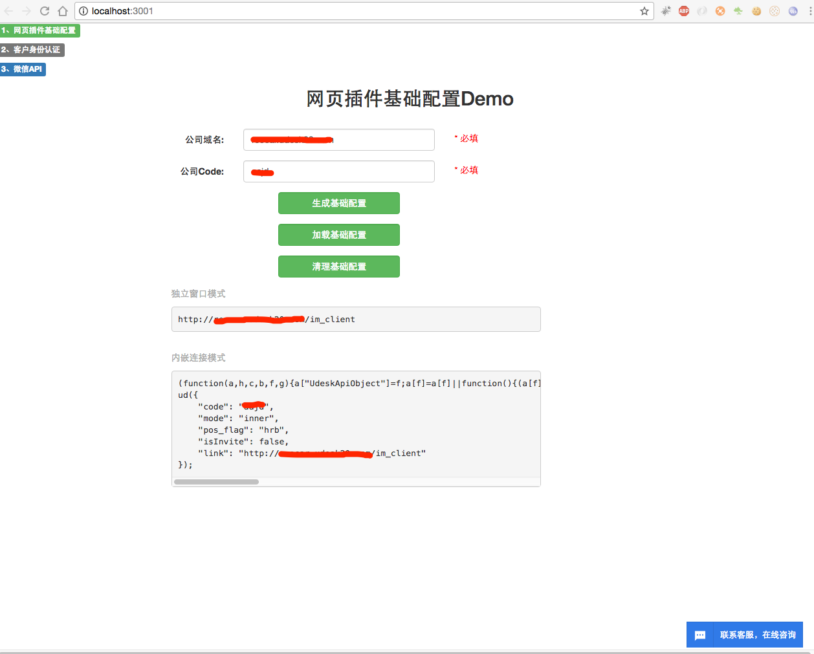

2017-07-28 更新
说明
=============================
本项目只提供事例参考代码，如开发者作为其他用途Udesk不承担其他责任，谢谢～

Demo模块
=============================
1、IM网页插件&身份认证 Demo

2、微信API Demo

运行环境
=============================
NodeJs v8.0.0

初始化
=============================
```
git clone git@github.com:wangmingle/udesk_im_demo.git

cd ./udesk_im_deom

npm instal node-dev -g

npm install

export PORTAL_VERSION=development && npm start

或者 
forever start ./bin/www
```

浏览器打开
=============================
http://localhost:3001/


配置说明
=============================
confing/default.json

```
{
    "company_domain": "当前公司的域名",
    "company_code": "公司code 获取位置【管理中心-即时通讯-网页插件-管理/code】",
    "web_plugin_id": "插件ID 获取位置【管理中心-即时通讯-网页插件-管理/web_plugin_id】",
    "im_user_key": "KEY 获取位置【管理中心-即时通讯-网页插件-管理/添加客户信息中的KEY】",
    "secret": "KEY 获取位置【管理中心-即时通讯-消息接口接入-KEY】"
}
```

配置说明
=============================

